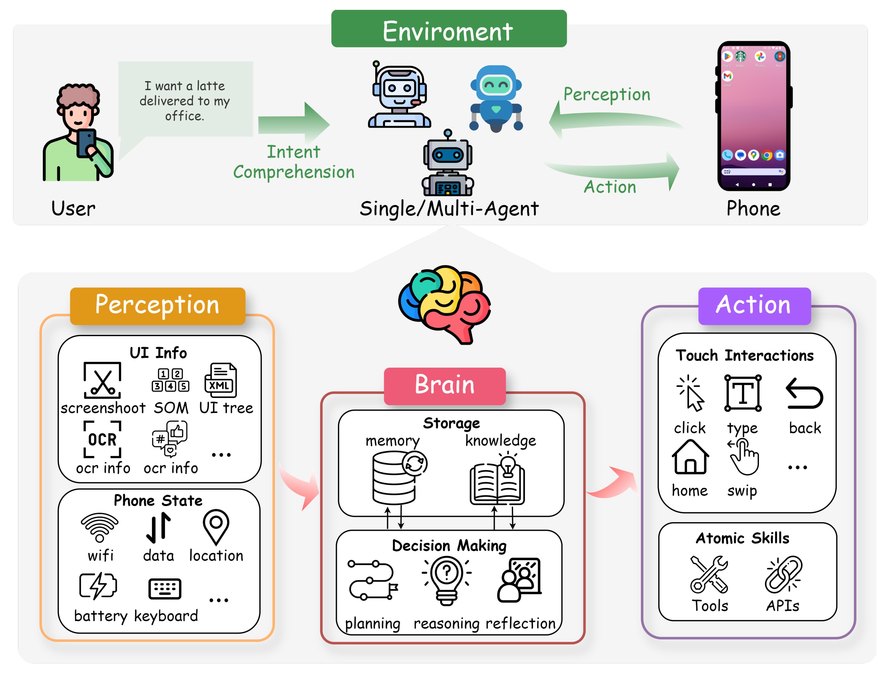

# Project Proposal: On-Device Personalized Agent using Fine-tuned Qwen3-0.6B

Brandon Howell

## 1. Introduction

<ins>Scope:</ins> This project aims to create a personalized AI assistant capable of running directly on an Android smartphone. The core involves fine-tuning a small, large language model (LLM), specifically Qwen3-0.6B[^qwen], with personal user data and other Android domain specific information. Subsequently, this personalized model will be integrated into an experimental Android agent framework (potentially a fork of Gosling[^gosling]) to enable it to perform tasks by interacting with other applications on my device.

[^qwen]: https://huggingface.co/Qwen/Qwen3-0.6B
[^gosling]: https://github.com/block/gosling

<ins>Problem:</ins> Current large language models most people are familiar with and use, while powerful, are typically generic and operate in the cloud, which raises privacy concerns and lacks more personalization. Running large models locally on resource-constrained devices like smartphones is computationally challenging. Enabling these models to interact with the device's applications and data in an automated fashion (i.e., act as agents) presents significant technical hurdles in the mobile environment. This project addresses the need for a private, personalized, and capable AI assistant that lives entirely on a user's device.

<ins>Interest & Non-Triviality:</ins> This project is interesting because it tackles the intersection of several cutting-edge AI domains that I've been following the news of closely for a while now:
- <ins>On-Device AI:</ins> Deploying capable LLMs on mobile phones pushes the boundaries of model optimization and efficient inference while preserving privacy.
- <ins>LLM Personalization:</ins> Fine-tuning with personal data explores methods to make AI truly tailored to an individual user's context, habits, and preferences.
- <ins>Agentic AI on Mobile:</ins> Integrating an LLM with device automation frameworks like Gosling explores the practical challenges and potential of creating autonomous agents in the complex and varied Android ecosystem.
- <ins>Parameter-Efficient Fine-Tuning (PEFT):</ins> Experimenting with techniques like adapters offers insights into efficient model adaptation for resource-constrained environments.

The combination of fine-tuning a very recent small LLM, deploying it locally, integrating personal context, and building agentic capabilities makes this project ambitious and non-trivial, offering ample room for experimentation and learning.

[^mobileagentimage]

[^mobileagentimage]: https://www.preprints.org/frontend/picture/ms_xml/manuscript/3da31779a6c7c196419c841cee5292cf/preprints-145259-g005.png

## 2. Related Work

The development of personalized, on-device AI agents draws upon research in several areas:

- <ins>Small Language Models (SLMs):</ins> The trend towards smaller, yet capable, language models is necessary for on-device deployment. Models like Phi-3 (Microsoft), Gemma (Google), and the chosen Qwen3-0.6B (Alibaba) represent efforts to achieve high performance with significantly fewer parameters than models like GPT-3/4. Their smaller size makes them candidates for mobile inference. The Qwen3 series specifically notes optimization for resource-constrained environments[^qwen3blog].
- <ins>On-Device LLM Inference:</ins> Techniques for efficiently running LLMs on mobile devices are critical. This includes model quantization (reducing the precision of model weights), optimized inference engines (like `llama.cpp`, MediaPipe LLM Inference, ONNX Runtime), and leveraging mobile NPUs/GPUs[^efficiency].
- <ins>LLM Fine-Tuning for Personalization:</ins> Adapting pre-trained LLMs to specific domains or user data is a common practice. While full fine-tuning modifies all parameters, **Parameter-Efficient Fine-Tuning (PEFT)** methods have gained prominence. Techniques like Adapter Tuning (Houlsby et al., 2019[^adapterspaper]), LoRA (Hu et al., 2021[^lora]), and QLoRA (Dettmers et al., 2023[^qlora]) allow adaptation by training only a small number of additional parameters. This is particularly relevant for on-device scenarios, reducing computational cost and storage requirements for personalized models.
[^adaptersimage]
- <ins>LLM-Powered Agents:</ins> Frameworks enabling LLMs to use tools, plan, and execute tasks have emerged (e.g., LangChain, AutoGPT). Applying these concepts to mobile environments involves interacting with apps and system services. Projects like Gosling from Block[^gosling] specifically explore agentic capabilities on Android, using platform features like Accessibility Services or custom inter-app communication protocols (like their proposed "mobile MCP") to automate tasks. This relates to broader research on autonomous agents and tool augmentation for LLMs.

[^qwen3blog]: https://qwenlm.github.io/blog/qwen3/
[^efficiency]: https://arxiv.org/abs/2312.03863
[^adapterspaper]: https://arxiv.org/abs/1902.00751
[^lora]: https://arxiv.org/abs/2106.09685
[^qlora]: https://arxiv.org/abs/2305.14314
[^adaptersimage]: https://magazine.sebastianraschka.com/p/finetuning-llms-with-adapters

## 3. Method

This project will be developed in two main phases:

**Phase 1: Personalized On-Device LLM Fine-tuning**

1. <ins>Model Selection:</ins> The core model will be Qwen3-0.6B, chosen for its small size and state-of-the-art performance within its parameter class[^qwen].
2. <ins>Data Collection & Preparation:</ins> A personal dataset will be curated, which may include (but is not limited to):
   - Calendar entries (structure, common events, timings).
   - Anonymized or synthesized communication logs (SMS/email snippets reflecting personal style, common contacts).
   - Personal notes or documents (FAQs about oneself, preferences, routines).
   - App usage patterns (e.g., frequently used apps for specific tasks).
   - Location habits (e.g., common places like "home", "work", "gym").
   - The format will likely be structured prompts and desired responses (instruction fine-tuning format).
3. <ins>Fine-tuning Implementation:</ins> Two fine-tuning approaches will be explored using libraries like Hugging Face `transformers` and `peft`:
   - <ins>Full Fine-tuning:</ins> Update all weights of the Qwen3-0.6B model on the curated personal dataset.
   - <ins>Adapter-based Fine-tuning (PEFT):</ins> Freeze the base Qwen3-0.6B model and train lightweight adapter modules[^adapterspaper][^lora][^qlora].
4. <ins>On-Device Deployment:</ins> The fine-tuned models (both versions) will be prepared for on-device execution. This will likely involve:
   - Quantization (e.g., to 4-bit using GGUF format).
   - Using an on-device inference engine compatible with Qwen models and Android, such as `llama.cpp`'s Android bindings or potentially adapting other frameworks if necessary.
   - Building a simple Android application wrapper to load the model and allow text-based interaction for initial testing.

**Phase 2: Agentic Integration with Gosling**

1. <ins>Framework Setup:</ins> Fork the Gosling Android agent repository. Familiarize with its architecture, particularly how it invokes LLMs and interacts with device capabilities (Accessibility Services, Intents, potential "mobile MCP").
2. <ins>Model Integration:</ins> Modify the forked Gosling code to use the personalized, locally deployed Qwen3-0.6B model (likely the PEFT version due to efficiency) as its reasoning engine. This will involve adapting the LLM API calls within Gosling to interface with the chosen on-device inference engine.
3. <ins>Tool Definition & Use:</ins> Explore Gosling's mechanisms for defining and using tools. This might involve:
    - Leveraging existing Gosling capabilities triggered via natural language prompts.
    - Potentially implementing a simple custom "mobile MCP" provider app (as shown in the Gosling README example) to expose a new capability (e.g., retrieving a piece of personal info directly).
4. <ins>Task Automation:</ins> Define and test simple, multi-step tasks that require the agent to use the personalized LLM and interact with other apps via Gosling's capabilities.

## 4. Evaluation

Success will be evaluated based on experimentation depth and insights gained, rather than solely on flawless execution.

**Phase 1 Evaluation (Personalized LLM):**

- <ins>Dataset:</ins> A held-out set of prompts based on the personal data domain (e.g., questions about schedule, preferences, communication style).
- <ins>Metrics:</ins>
  - <ins>Qualitative Assessment:</ins> Subjective evaluation of the model's responses for personalization (does it know my context?), accuracy (correct information), coherence, and tone compared to the base Qwen3 model.
  - <ins>Quantitative Assessment (Exploratory):</ins>
    - Perplexity on the held-out personal dataset.
    - Resource Usage: Measure model storage size (base vs. full fine-tune vs. base + adapter), inference latency, and peak memory usage on the Android device for both fine-tuning approaches.
  - <ins>Comparison:</ins> Directly compare the effectiveness and resource trade-offs between the fully fine-tuned model and the adapter-based model.

**Phase 2 Evaluation (Agentic Capabilities):**

- <ins>Dataset:</ins> A set of defined, multi-step tasks requiring interaction with device features or apps.
- <ins>Metrics:</ins>
  - <ins>Task Completion Rate:</ins> Percentage of tasks successfully completed by the agent.
  - <ins>Qualitative Assessment:</ins> Evaluate the agent's planning ability, tool usage effectiveness, error handling, and overall usefulness for the defined tasks. Does the personalization from Phase 1 demonstrably improve task execution (e.g., using correct contact names, understanding implicit context)?
  - <ins>Efficiency (Observational):</ins> Note the time taken and number of steps/interactions required for task completion.

## 5. Milestones

- <ins>Week 6:</ins> Download Qwen model and test its current capabilities, begin making fine tuning dataset
- <ins>Week 7:</ins> Fine tune and test new model, evaulate success, where new model succeeds that old model didn't
- <ins>Week 8:</ins> Assuming above has gone well, fork Gosling and begin working on Agent integration
- <ins>Week 9:</ins> Combine fine-tuned Qwen3 with Gosling to automate tasks, test and get quantitative results of success
- <ins>Week 10:</ins> Wrap up any last features, test, and evaluations and finish report

## 6. Task Assignments

I'm working solo for this project since there was some miscommunication with groups, so don't have to worry about splitting up tasks.

