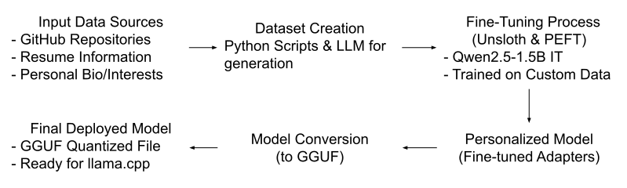

### **On-Device Personalized Agent: Fine-tuning Qwen for a Private, Custom AI Assistant**

**Brandon Howell**

### **1. Introduction**

Today's most popular AI assistants, such as Siri, Alexa, and Google Assistant, have become integrated into daily life. However, their architecture presents significant limitations. They are overwhelmingly cloud-based, generic in their knowledge, and operate as "black boxes." This project directly addresses these shortcomings by exploring the creation of a truly personal, private, and powerful AI assistant that runs entirely on a user's local hardware.

**The Problem and Project Scope**

The reliance on cloud infrastructure for current AI assistants introduces several key issues:
*   **Privacy Concerns:** User data, conversations, and context are sent to and processed on remote servers, creating potential privacy risks and a sense of unease.
*   **Latency and Connectivity:** Functionality is dependent on a stable internet connection, and even with one, network latency (ping) prevents instantaneous responses.
*   **Lack of Deep Personalization:** While they may know a user's name or home address, their understanding is shallow. They lack knowledge of a user's personal context, habits, professional background, or specific projects, making their assistance generic and limited.
*   **Opacity:** The inner workings of these large, proprietary models are hidden, making it impossible to understand their biases or the reasoning behind their outputs.

The scope of this project was to build and evaluate a proof-of-concept AI assistant that is **100% local, private, and deeply personalized**. The core of the project involved fine-tuning a small but capable large language model (LLM), specifically **Qwen2.5-1.5B**, with a curated dataset of my personal, professional, and project-related information. The goal was to create a model that could accurately answer questions about my own life and work, operating with high performance on resource-constrained hardware without needing an internet connection.

**Impressive Results: A Glimpse of True Personalization**

The project successfully demonstrated the feasibility of this approach. The fine-tuned model, running locally, could respond to specific, personal queries with information it could not have previously known. For instance, when prompted with questions about my technical skills or specific coding projects, the model provided accurate and contextually relevant answers.

***Example Interaction:***

> **User:** What is Brandon's Disc Metrics repo?
>
> **Fine-tuned Model:** This repository contains the code and documentation for the disc_metrics project, which provides a simple, fast, and reliable way to measure disc golf throw performance.

This level of detailed recall, combining professional skills with specific project summaries, showcases the power of targeted fine-tuning. Critically, these results were achieved with impressive speed, with an average inference time of just **469.5 ms** on a local machine, including the time to load the model.

This project is non-trivial as it sits at the intersection of several cutting-edge AI fields: on-device model deployment, parameter-efficient fine-tuning (PEFT), and the creation of highly specialized, personalized AI. It tackles the practical challenges of data curation, model adaptation, and performance optimization required to move AI from the cloud onto our personal devices.

### **2. Related Work**

The development of a personalized, on-device agent draws upon significant research across multiple domains.

**Small Language Models (SLMs):** The key enabler for on-device AI is the recent trend towards creating smaller models that retain significant capabilities. While massive models like GPT-4 dominate the headlines, models such as Microsoft's Phi-3, Google's Gemma, and Alibaba's Qwen series are designed for high performance with far fewer parameters. The Qwen model family, in particular, has been noted for its optimization for resource-constrained environments and strong performance in its weight class (Qwen Team, 2024). These SLMs make local inference on devices like smartphones and laptops computationally feasible.

**On-Device LLM Inference:** Running models efficiently on consumer hardware is a field of active research. The primary techniques include:
*   **Quantization:** This process reduces the numerical precision of the model's weights (e.g., from 16-bit floating-point to 4-bit integers). This dramatically shrinks the model's storage size and memory footprint, and can accelerate computation on compatible hardware. Frameworks like `llama.cpp` and its GGUF format are industry standards for deploying quantized models.
*   **Optimized Inference Engines:** Software like MediaPipe LLM Inference, ONNX Runtime, and `llama.cpp` are specifically designed to leverage the unique hardware of mobile devices (NPUs, GPUs) to run LLM computations as fast as possible.

**Parameter-Efficient Fine-Tuning (PEFT):** Fully fine-tuning an entire LLM, even a small one, is computationally expensive and memory-intensive. PEFT methods have emerged as a more efficient alternative. Instead of updating all of the model's billions of parameters, PEFT techniques freeze the pre-trained model and insert a small number of new, trainable parameters.
*   **Adapters:** Houlsby et al. (2019) introduced small, bottleneck-like modules inserted between the layers of a transformer model. Only these adapters are trained, preserving the original model's knowledge.
*   **Low-Rank Adaptation (LoRA):** Hu et al. (2021) proposed decomposing the weight update matrices during fine-tuning into two smaller, low-rank matrices. This drastically reduces the number of trainable parameters.
*   **QLoRA:** Dettmers et al. (2023) combined PEFT with quantization, enabling the fine-tuning of a quantized model with low-rank adapters. This technique, which is leveraged by the Unsloth library used in this project, dramatically lowers the memory requirements for fine-tuning, making it possible to train models on consumer-grade GPUs.

**LLM-Powered Agents:** The concept of an AI "agent" that can use tools to perform tasks is a major research direction. Frameworks like LangChain and AutoGPT demonstrated how LLMs could plan and execute complex workflows. Applying this to mobile environments is a newer frontier. Projects like Gosling by Block (2024) explore how an LLM can interact with the Android operating system, using platform features like Accessibility Services to read the screen and perform actions within other apps. This body of work provided the inspiration for the project's original vision and its future work.

### **3. Method**

The project's methodology was focused on a three-stage pipeline: (1) curating a high-quality, personalized dataset, (2) fine-tuning the LLM using this dataset, and (3) preparing the model for local deployment.

The overall system is illustrated in the flowchart below. The primary inputs are my personal data and public code repositories, and the final output is a single, quantized model file (in GGUF format) capable of running locally.

**Figure 1: Project Methodology Flowchart**

**1. Data Collection and Preparation**

The quality of a fine-tuned model is entirely dependent on the quality of its training data. A multi-faceted dataset was created:
*   **Professional Data:** Information from my resume, answers to typical interview questions, and descriptions of my technical skills and experiences were compiled.
*   **Personal Data:** A brief biography including my name, hobbies, and key interests was written.
*   **Coding Projects Data:** This was the most complex part of the data pipeline. A Python script was developed to process my public GitHub repositories. For each chosen repository, the script would:
    1.  Read the `README.md` file and key source code files.
    2.  Use a more powerful LLM (e.g., Gemini 2.5 Pro via an API or Qwen3 32B locally) to generate a detailed, high-level summary of the project's purpose, architecture, and key features.
    3.  Feed this summary back into the LLM with a specific prompt to generate a series of question-and-answer pairs based on the summary. For example: "What is the main goal of this project?" or "What technologies were used in this project?"

This synthetic data generation approach created a rich, structured dataset in the instruction-following format required for fine-tuning. The final dataset was formatted as a JSONL file, where each line contained a dictionary with "instruction," "input," and "output" keys, following a standard template.

**2. Fine-Tuning the Model**

The fine-tuning process was implemented using Unsloth, a library that dramatically accelerates Hugging Face training and reduces memory usage.
*   **Model:** The base model chosen was **Qwen2.5-1.5B**, a model from Alibaba known for its strong performance in the small model category.
*   **Framework:** The fine-tuning script was adapted from Unsloth's official examples. It utilized the Hugging Face `transformers` library for model handling, `peft` for implementing the QLoRA technique, and `bitsandbytes` for 4-bit quantization.
*   **Process:** The script loaded the 4-bit quantized Qwen2.5-1.5B model, added LoRA adapters to it, and then trained *only* these adapters on the custom-generated dataset. This PEFT approach ensured that the training process was fast and could run on a single, freely available Google Colab T4 GPU. The entire training process completed in under six minutes.

**3. Model Conversion for Deployment**

After fine-tuning, the trained LoRA adapters were merged with the base model weights to create a complete, personalized model. This model was then converted from the Hugging Face format to the **GGUF (GPT-Generated Unified Format)**. GGUF is the standard format used by the `llama.cpp` inference engine, which is highly optimized for running LLMs efficiently on CPUs and GPUs across various platforms, including desktops and mobile devices. This final GGUF file is the self-contained, portable assistant, ready for local use.

### **4. Evaluation**

The evaluation of the project was two-fold, combining quantitative performance metrics with a qualitative assessment of the model's personalized knowledge and behavior.

**Quantitative Results**

The performance metrics collected were highly encouraging and aligned with the project's goal of creating a fast and efficient local model.
*   **Training Performance:** On a single T4 GPU provided by Google Colab, the model was fine-tuned in just **5 minutes and 44 seconds**. During this time, both the training and validation loss consistently decreased, indicating that the model was successfully learning the patterns in the custom dataset without significant overfitting.
*   **Inference Speed:** The final, quantized GGUF model demonstrated excellent performance. The average time to generate a response, including the initial loading of the model into memory, was **469.5 milliseconds**. This is effectively instantaneous for a user, a stark contrast to the potential latency of cloud-based assistants.

**Qualitative Results**

The primary goal was to see if the model understood me. The results here were promising but also revealed some classic limitations of smaller LLMs.
*   **Successes:** The model excelled at recalling information it was explicitly trained on. It could accurately summarize my coding projects, list my technical skills, and answer questions about my background. It successfully connected different pieces of information, as shown in the Python/`disc_metrics` example in the introduction. This confirmed that the fine-tuning was effective.
*   **Shortcomings and Hallucinations:** The model was not without its flaws. The most common issue was **hallucination**, where it would correctly recall a piece of information but place it in the wrong context. For example, it correctly identified and described my `disc_metrics.ipynb` project, but then incorrectly stated it was part of a homework assignment for a specific class, a detail it invented by conflating two separate pieces of information from its training data. This is a known challenge with LLMs, especially smaller ones that may have a weaker grasp on factual boundaries.
*   **Integration Challenges:** A practical shortcoming was discovered during testing. The model was fine-tuned on a very specific instruction format (`### Instruction: ... ### Input: ... ### Response: ...`). When loaded into generic front-end applications that did not support custom prompt templates, the model's outputs appeared nonsensical. This is not a failure of the model itself, but a reminder that the entire system, from user interface to model, must be aligned.

**Progression and Comparison to Expectations**

The project's progression was iterative. The initial results with a small, quickly generated dataset showed promise but lacked depth. The second iteration focused heavily on improving the dataset creation pipeline, particularly for the GitHub repositories, which significantly enhanced the model's recall ability.

Compared to the initial hypothesis in the project proposal, the core goal of creating a personalized, local LLM was successfully met and even exceeded expectations in terms of performance. The pivot away from the Android Agent (Gosling) integration was a necessary adjustment of scope due to the complexities of that framework. While the fine-tuning was a success, the results also confirmed the hypothesis that small models are prone to hallucination, reinforcing the need for strategies like Retrieval-Augmented Generation (RAG) in future work.

### **5. Conclusions and Future Work**

**Conclusion**

This project successfully demonstrated that it is possible to create a fast, private, and deeply personalized AI assistant by fine-tuning a small language model on a curated dataset. The resulting model runs entirely locally, responds nearly instantly, and possesses a nuanced understanding of my professional and personal context that is unattainable with generic, cloud-based assistants. The use of parameter-efficient fine-tuning (PEFT) with Unsloth proved to be a highly effective and accessible method for achieving this personalization on consumer-grade hardware. While the model exhibits some common LLM weaknesses like hallucination, it serves as a powerful proof-of-concept for the future of truly personal AI.

**Future Work**

The project's outcome opens up numerous avenues for future exploration. The original vision of creating an on-device agent remains a compelling next step.
*   **AI Agent Integration:** The original plan to integrate the model with an Android agent framework like **Gosling** is the most direct path forward. This would involve modifying Gosling to use the local, fine-tuned Qwen model as its reasoning engine, allowing the assistant to not just answer questions but also perform actions on the device, such as opening apps, sending messages, or managing settings based on personalized context.
*   **Retrieval-Augmented Generation (RAG):** To combat hallucination and provide the model with access to up-to-the-minute information, a RAG system could be implemented. This would involve creating a vector database of personal documents (notes, emails, etc.) on the device. When a query is made, the system would first retrieve the most relevant documents and provide them to the LLM as context, grounding its responses in factual data and reducing the likelihood of invention.
*   **Real-Time Context:** The agent could be enhanced by giving it access to real-time information, such as current location, calendar notifications, or on-screen content. This would enable more proactive and context-aware assistance.
*   **Expanding the Dataset and Model:** As newer, more capable small models are released, this process could be repeated to improve the agent's reasoning abilities. The dataset could also be expanded to include more diverse personal data, such as communication style from anonymized messages.
*   **Multi-Modality:** Future work could explore multi-modal inputs, allowing the assistant to respond to voice commands or even understand information from images taken with the device's camera.
*   **Personalized Code Assistant:** The model's knowledge of my coding projects could be leveraged to create a specialized code assistant. Rather than generating new code, it could help with ideation and recall, answering questions like, "What was the name of that function I wrote to handle API authentication in the `project-alpha` repository?"

In summary, this project has laid a strong foundation. The future lies in building upon this personalized knowledge base to create a capable, autonomous agent that truly works for the user, on the user's own terms.

### **References**

Block, Inc. (2024). *Gosling: An on-device AI agent for Android*. GitHub. Retrieved from https://github.com/block/gosling

Dettmers, T., Pagnoni, A., Holtzman, A., & Zettlemoyer, L. (2023). *QLoRA: Efficient Finetuning of Quantized LLMs*. arXiv preprint arXiv:2305.14314.

Houlsby, N., Giurgiu, A., Jastrzebski, S., Morrone, B., de Laroussilhe, Q., Gesmundo, A., Attariyan, M., & Gelly, S. (2019). *Parameter-Efficient Transfer Learning for NLP*. Proceedings of the 36th International Conference on Machine Learning.

Hu, E. J., Shen, Y., Wallis, P., Allen-Zhu, Z., Li, Y., Wang, S., Wang, L., & Chen, W. (2021). *LoRA: Low-Rank Adaptation of Large Language Models*. arXiv preprint arXiv:2106.09685.

Qwen Team. (2024). *Qwen2: The new generation of open-source large language models*. QwenLM Blog. Retrieved from https://qwenlm.github.io/blog/qwen2/
